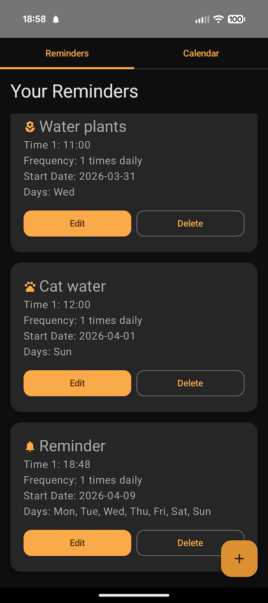
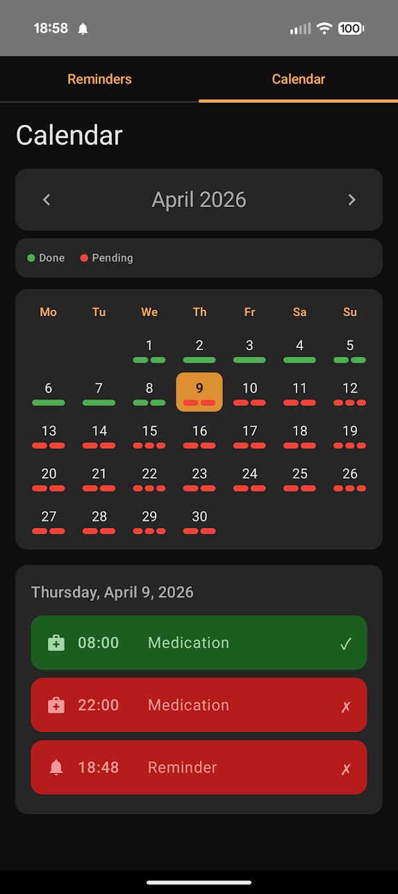

# Calendar Reminder

Lightweight Android app for offloading recurring tasks from your brain. Set up weekly reminders once — watering plants, taking vitamins, feeding pets, any habit — and let the app track whether they got done.

## Screenshots

  
  

## Features

- **Weekly Scheduling** — Pick which days of the week and what times each reminder fires
- **Completion Tracking** — Calendar view shows a color-coded history of completed vs. missed reminders
- **Multiple Daily Times** — Schedule a reminder to fire more than once per day
- **Optional End Date** — Set a reminder to expire after a certain date, or leave it open-ended
- **100+ Custom Icons** — Choose from icons across 7 categories: General, Health, Nature, Food, Home, Work, and Sport
- **Discrete Notifications** — Notifications show only the name you give the reminder, nothing else
- **Always Works** — Survives device reboots, no internet connection required

## Privacy

**100% offline. Zero data collection.**

All data is stored locally using SQLite. No cloud sync, no analytics, no external servers. The only permission required is notifications. Your data never leaves your device.

## Requirements

- Android 8.0+ (API 26)
- ~5 MB storage
- Notification permission (prompted on first run)

## Tech Stack

- Kotlin + Jetpack Compose (Material 3)
- Room (SQLite) for local storage with tracked schema migrations
- AlarmManager + WorkManager for reliable scheduling
- MVVM architecture
