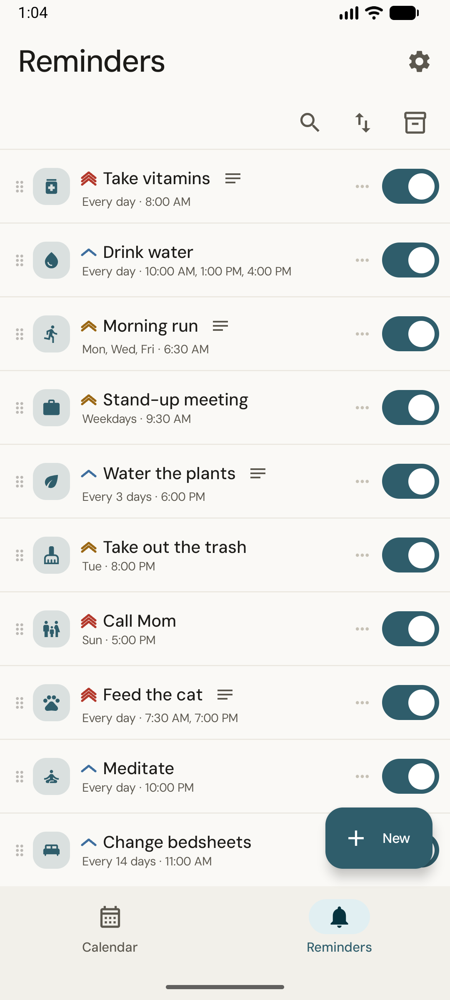
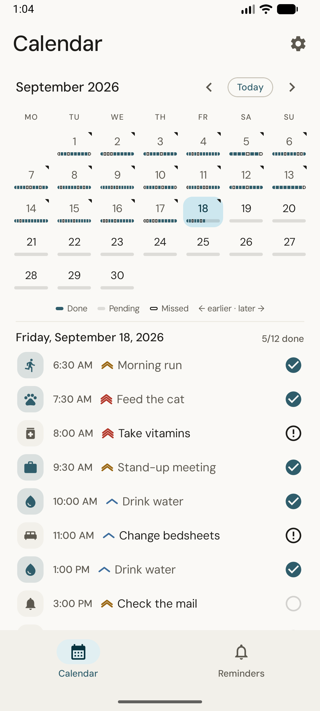
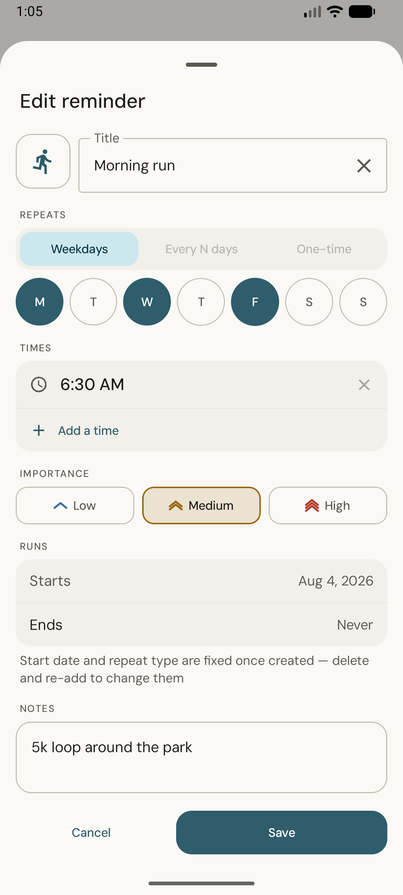
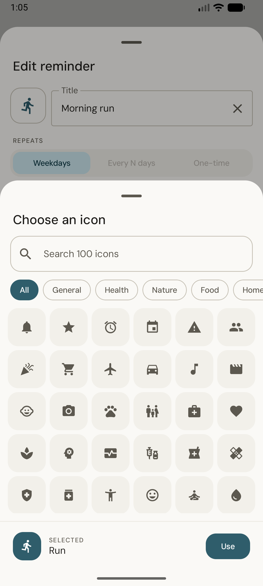
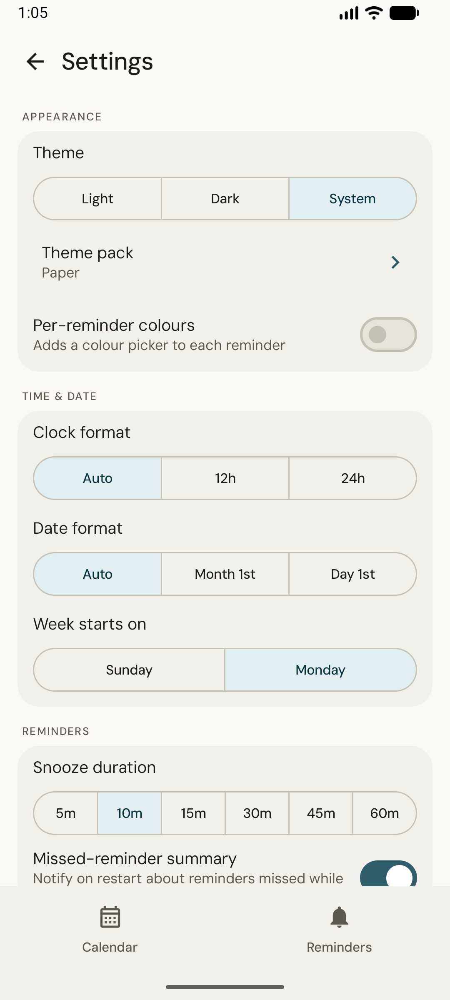
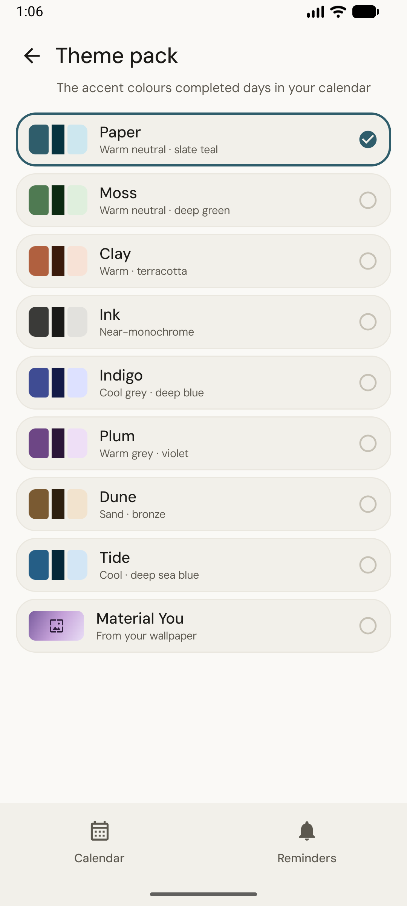
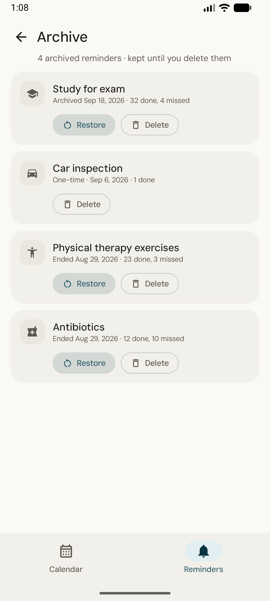
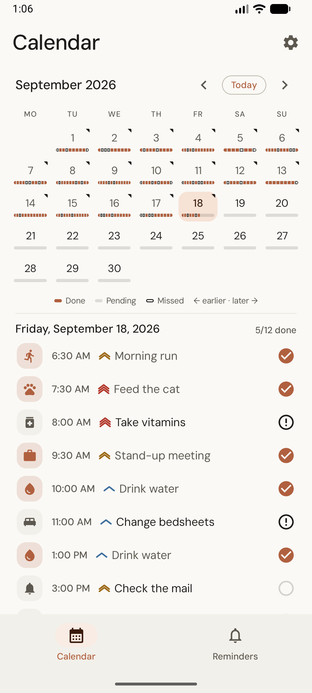
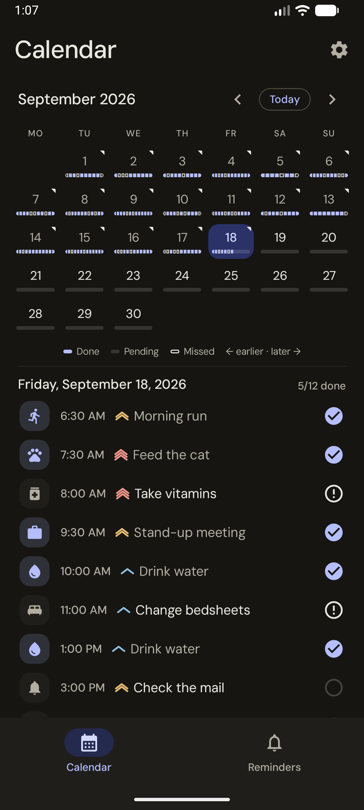
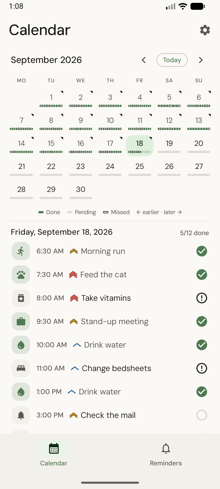

# Calendar Reminder

Lightweight Android app for offloading recurring tasks from your brain. Set up weekly reminders once — watering plants, taking vitamins, feeding pets, any habit — and let the app track whether they got done.

## Screenshots

  
  
  
  

  
  
  

### Theme packs

The same calendar in three of the eight packs — each works in light and dark.

  
  
  

## Features

- **Flexible Scheduling** — Specific weekdays, every N days, or a one-time reminder
- **Multiple Daily Times** — Schedule a reminder to fire more than once per day
- **Completion Tracking** — The calendar shows done, pending and missed at a glance, one pip per occurrence
- **Importance Levels** — Low, medium or high, which drives how insistent the notification is
- **Snooze** — Defer an occurrence without it counting as missed
- **Missed Summary** — On restart, a notification lists what was missed while the device was off
- **Sort, Filter & Search** — Drag to reorder, or sort by next occurrence, importance, date added or title
- **Archive** — Lapsed reminders are kept with their history until you delete them, and can be restored
- **8 Theme Packs + Material You** — Light, dark or system, with optional per-reminder colours
- **100+ Custom Icons** — Choose from icons across 7 categories: General, Health, Nature, Food, Home, Work, and Sport
- **Optional End Date** — Set a reminder to expire after a certain date, or leave it open-ended
- **Discrete Notifications** — Notifications show only the name you give the reminder, nothing else
- **Always Works** — Survives device reboots, no internet connection required

## Privacy

**100% offline. Zero data collection.**

All data is stored locally using SQLite. No cloud sync, no analytics, no external servers. The only permission required is notifications. Your data never leaves your device.

## Requirements

- Android 8.0+ (API 26)
- ~5 MB storage
- Notification permission (prompted on first run)

## Tech Stack

- Kotlin + Jetpack Compose (Material 3)
- Room (SQLite) for local storage, with schema history exported per version
- DataStore Preferences for settings
- AlarmManager + WorkManager for reliable scheduling
- MVVM architecture
